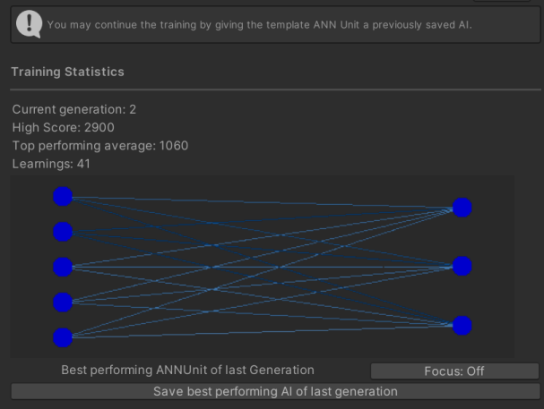

# Approachable Artifical Neural Network

     

"Approachable Artifical Neural Network" aims to drastically lower the barrier of entry for the Artifical Neural Network AI and NEAT learning Algorithm within the context of Unity Game Development.
This Project was created for my final exam at the [S4G School for Games](https://www.school4games.net/).

# Overview
 

     

Artifical Neural Networks are a special kind of AI that work similar to human brains. This makes the AI very flexible, as that allows it to find gameplay patterns on its own. 
This asset boils down the usage of this algorithm to the following:
 1. What can the AI see? (in this case 5 different distances in front of them)
 2. What can the AI do? (in this case turn left, turn right and control the speed)
 3. When does the AI do something good/bad? (in this case it gets punished for touching the track boundary and rewarded based on how far it got)

And that's all you have to do. After you trained the AI you are able to save and manage them as simple scriptable object.
For more informations check out the full [Documentation](https://github.com/BasKrueger/Approachable-Artifical-Neural-Network/blob/main/Documentation.pdf), which also goes over how exactly the Algorithm behind the magic works.

# How to Run
Simply download the reposetory and open the "Project" folder using at least Unity 2022.3.

# Highlight editor extensions
 

     

The project makes extensive use of various editor tools. Various abstract topics like the internal mechanism of the AI are live visualized in the inspector, alongside handy buttons and other subtle features to make your life easier. 

